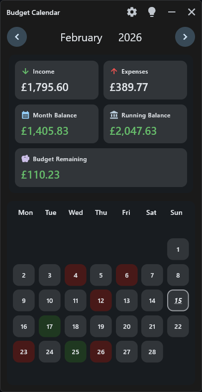
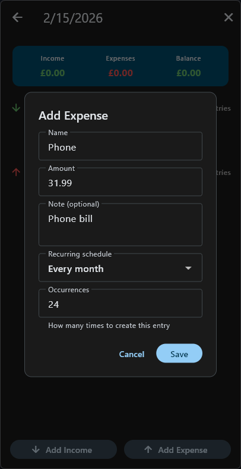

# BudgetCalendar

BudgetCalendar is a Flutter desktop-first budgeting calendar app, ported from the original Python/Tkinter version.

## Download Installer
- Get the latest Windows installer from GitHub Releases.
- Release tag: `0.1`
- Installer file: `BudgetCalendar-Setup-v0.1.0.exe`

## Screenshots



## Features
- Calendar-based budgeting with month navigation.
- Per-day income and expense entries with add, edit, and delete.
- Optional notes on each entry.
- Recurring entries: every week, every 2 weeks, every 4 weeks, every month.
- Monthly totals: income, expenses, month balance, running balance, budget remaining.
- Day-level indicators: entry count, day net amount, optional running-balance hover tooltip.

## Settings and Accessibility
- Currency symbol, starting balance, monthly budget target.
- Dark mode.
- High contrast mode (applies across app dialogs/popups too).
- Text magnification (high magnification support).
- Week start day selection (Sun/Mon/Sat).
- Optional minimize-to-tray behavior on Windows.
- Color customization for income, expense, and mixed-income/expense days.
- Draggable panel layout (month header / totals / calendar) with persistence.

## Data Safety and Portability
- Local JSON persistence with automatic save.
- Manual backup snapshots and restore latest backup.
- JSON export (copy to clipboard) and JSON import (validation + safety checks).
- Import path includes failsafes and backup-first behavior.

Windows data location:
- `%APPDATA%\Budget_Calendar\budget_data.json`

## Run From Source
Requirements:
- Flutter SDK (tested with Flutter 3.35.x / Dart 3.9.x)

```powershell
flutter pub get
flutter run -d windows
```

## Test and Lint
```powershell
flutter analyze
flutter test
```

## Build Windows Release
```powershell
flutter build windows --release
```

Portable output folder:
- `build\windows\x64\runner\Release\`

## Build Windows Installer (Inno Setup)
Requirements:
- Inno Setup 6 (`ISCC.exe`)

One-command build (Flutter release + installer):
```powershell
powershell -ExecutionPolicy Bypass -File .\scripts\build_installer.ps1
```

Optional flags:
```powershell
# Override installer version
powershell -ExecutionPolicy Bypass -File .\scripts\build_installer.ps1 -AppVersion 1.2.3

# Build debug binaries before packaging (normally release)
powershell -ExecutionPolicy Bypass -File .\scripts\build_installer.ps1 -Configuration debug

# Provide explicit ISCC path if not on PATH
powershell -ExecutionPolicy Bypass -File .\scripts\build_installer.ps1 -IsccPath "C:\Program Files (x86)\Inno Setup 6\ISCC.exe"
```

GNU-style `--` flags are also supported:
```powershell
powershell -ExecutionPolicy Bypass -File .\scripts\build_installer.ps1 --app-version 0.1.0 --configuration release
powershell -ExecutionPolicy Bypass -File .\scripts\build_installer.ps1 --iscc-path "C:\Program Files (x86)\Inno Setup 6\ISCC.exe"
```

Installer output:
- `dist\installer\BudgetCalendar-Setup-v<version>.exe`
