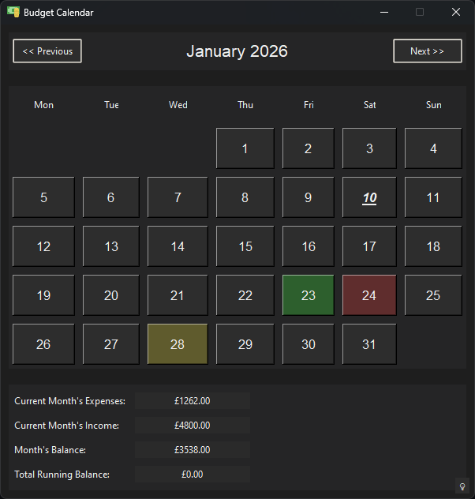
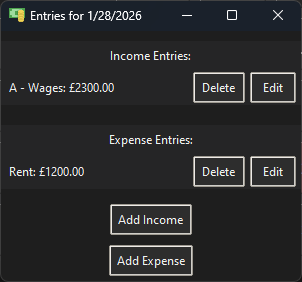

# Budget Calendar

A simple Windows desktop budget calendar built with Tkinter. Track income and expenses by day, view monthly totals and a running balance, with light and dark themes.

## Features
- Month calendar with day-level income/expense entries
- Monthly totals and running balance
- Dark mode toggle with Windows dark titlebar request
- Data stored locally in JSON

## Screenshots



## Requirements
- Python 3.10+ (tested with Python 3.12)

## Run
```powershell
py budget.pyw
```

## Build (single EXE)
```powershell
pyinstaller --onefile --windowed --icon icon.ico budget.pyw
```

## Data
- Data file: `budget_data.json`
- Dark mode state is persisted in `budget_data.json` under `settings.dark_mode`

## Project layout
```
budget.pyw        # main app
budget_data.json  # local data store
icon.ico          # app icon
```

## Notes
- The Windows titlebar dark mode request depends on OS theme/settings.
